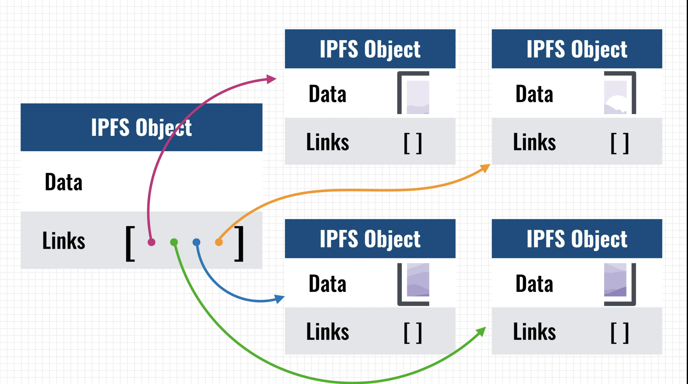

# Ethereum

## Accounts
- in ehtereum, the state is made of objects called "accounts'. State transitions are direct transfer of value and information between accounts. It has 4 fields:
  - nonce (what's the use of nonce??): integer that is incremented everytime the contract is executed. what happens for EOA(??)
  - ether balance
  - contract code, if present
  - account's storage, if present

- **Externally owned accounts** (controlled by private keys) and **contract accounts** (controlled by contract code)
- smart contract addressed identify a smart contract on the blockchain
- EOA is mostly controlled by humans, but you might give the private key to a program off blockchain, and so the EOA is now owned by that program.

## Transactions

1. a transaction is used to in ethereum is a signed data packaged that stores a message to be sent from an external owned account. It contains:
- receipient of the message
- signature identifying the sender (using private key of sender)
- amount of ether to be transferred (expressed in wei, where 1 ether = 10^18 wei)
- optional data field (what's the use??)
- STARTGAS - maximum number of computation steps the transaction execution is allowed to take
- GASPRICE - fee (ether, actually expressed as gwei, where 1 ether = 10^9 gwei) the sender pays per computational step (1 gas).  

2. STARTGAS and GASPRICE are crucial for enthereum's anti-denial of service model (to prevent malicious infinite loops or computational wastage). The fundamental unit of computations is **gas**. Usually each computational step costs 1 gas, but some steps might cost more because they are more expensive to perform or result in storage increase. Also, for each byte in transaction data, there is a fees of 5 gas.
3. The idea is to require an attacker to pay proportionately for each kind of resource they use - computations, bandwidth or storage.

## Messages
1. contracts have the ability to send "messages" to other contracts. These are virtual objects that're never serialized and exist only in the ethereum execution environment. It contains:
- sender of the message
- recipient 
- amount of ether to transfer
- optional data field
- STARTGAS value

2. message is like a transaction, except that it's produced by a contract and not an external actor. It allows contracts to have relationships with other contracts, in the same way external accounts can.
3. Gas allowances assigned transaction or contract applies to the total gas consumed by that transaction and all sub-executions.
4. Why does messages have to GASPRICE (??) - perhaps because GASPRICE is "inherited" from the initial transaction package.

## Code execution 
- written in EVM code. In general the code execution is an infinite loop, which consists of repeatedly executing the operation at the current program counter. This is done until end of code is reached or error or STOP or RETURN instruction is found.
- the code can store data in following space: The **stack**, **memory** (infititely expandable), contract's **long term key-value store** (unlike stack and memory which is reset after contract's execution complete, this can persist for long term)
- it can access value, sender, data of the incoming message.

## ethereum blockchain and mining
- ethereum blockchain additionally stores the recent state (apart from the transaction list like in bitcoin), the difficult and block number.
- [patricia trie](https://www.youtube.com/watch?v=dbTVU8jR0Vs): trie -> compact trie -> patricia trie (most compact trie)
- because state information is available for the previous block, there's no need to store the entire blockhain history.

---
## more concepts
### decentralized storage
- think of it as a p2p network where members pool together their disk space to create a global shared memory. A deccentralized dropbox of sorts.
- **IPFS** (InterPlanetary file System) and **swarm** are examples
- Swarm is part of ethereum stack. It provides the storage layer for ethereum (it's part of **geth**)

- IPFS uses content based addressing (where you query for a file based on its hash) rather than location based addressing (used by traditional web, https://www.example.com/cat.jpg etc.).  
IPFS can download the content (identified by hash) from any peer. The content can be checked to see if the hash matched (hence security).
- Content is created only once => very efficient
- immutable. Data modification happens based on versioning
- problems: availability (same as bittorrent without users) - the solution is to either incentivize the nodes or proactively distribute files. This is what **Filecoin** intends to do. It's build on top of IPFS.
- applications? see [IPFS getting around wikipedia censorship by Turkey](https://blog.ipfs.io/24-uncensorable-wikipedia/), and [dtube](https://d.tube/) - decentralised youtube

- links: [decentralized storage explained](https://www.youtube.com/watch?v=5Vu_jwPjvww)

### Ethereum holy trinity: Swarm, Ethereum and Whisper
- Swarm provides the storage layer, ethereum provides the computation power and whisper provides the messaging layer.
- decentralized internet
