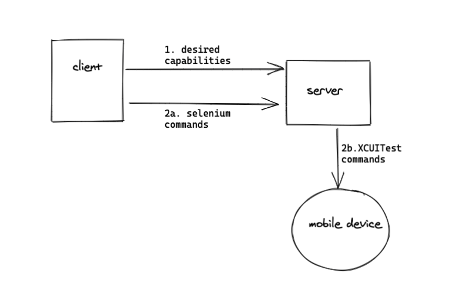

# Appium

[udemy course on appium](https://www.udemy.com/course/mobile-automation-using-appiumselenium-3/?utm_source=adwords&utm_medium=udemyads&utm_campaign=DSA_Catchall_la.EN_cc.INDIA&utm_content=deal4584&utm_term=_._ag_82569850245_._ad_437477497173_._kw__._de_c_._dm__._pl__._ti_dsa-485138043266_._li_1007748_._pd__._&matchtype=b)  
[testing mobile apps with appium on aws device farm](https://aws.amazon.com/blogs/mobile/testing-mobile-apps-with-cucumber-and-appium-through-testng-on-aws-device-farm/)  
[appium blog](https://appiumpro.com/edition)  
It's not a testing framework per se, but a framework for UI interaction. The Appium APIs for both Android and iOS are almost identical, which means if the applications are similar, your tests for the two will share most of the code.




## interesting features

- allows to test things like installing/uninstalling the app (could be useful to test login flows)
- write once, run on both the mobile platforms.
- works with cross platform languages (like flutter etc.)
- Appium translates selenium webdriver commands into UIAutomation/XCUITest (iOS) or UIAutomator (Android) commands depending on device type.
- Use browserstack to get the devices you want to test on (rather than relying on the simulators).

---
## Rough stuff

- install appium desktop (essentially appium server)
- setup XCUITest driver for iOS
- setup a client (will use java-client)


check setup
- `npm install -g appium-doctor; appium-doctor`
- JAVA_HOME has to be setup: `export JAVA_HOME=$(/usr/libexec/java_home)`
- then appium-doctor spits out more dependencies:
```
info AppiumDoctor ### Optional Manual Fixes ###
info AppiumDoctor The configuration can install optionally. Please do the following manually:
WARN AppiumDoctor  ? Why opencv4nodejs is needed and how to install it: https://github.com/appium/appium/blob/master/docs/en/writing-running-appium/image-comparison.md
WARN AppiumDoctor  ? mjpeg-consumer module is required to use MJPEG-over-HTTP features. Please install it with 'npm i -g mjpeg-consumer'.
WARN AppiumDoctor  ? set-simulator-location is needed to set location for Simulator. Please read https://github.com/lyft/set-simulator-location to install it
WARN AppiumDoctor  ? Why idb is needed and how to install it: https://github.com/appium/appium-idb
WARN AppiumDoctor  ? Why applesimutils is needed and how to install it: http://appium.io/docs/en/drivers/ios-xcuitest/
WARN AppiumDoctor  ? bundletool.jar is used to handle Android App Bundle. Please read http://appium.io/docs/en/writing-running-appium/android/android-appbundle/ to install it
WARN AppiumDoctor  ? gst-launch-1.0 and gst-inspect-1.0 are used to stream the screen of the device under test. Please read https://appium.io/docs/en/writing-running-appium/android/android-screen-streaming/ to install them and for more details

```

for iOS, installing [idb](https://fbidb.io/) and [applesimutils](https://github.com/appium/appium-xcuitest-driver) as they seem relevant.  
Indeed they are! IDB is for things like setting location, while apple simulation utils allow you to use permissions capability.

- Having trouble installing the java or objc appium client. The documentation is not clear and it's a major concern. Trying out the [python client](https://github.com/appium/python-client) as it seems to have sufficiently clear documentation.  
Some ssl errors. Can't install anything via pip  
Unresolved still. Can install python client using source. But now thinking of setting up the java sample tests they have (for iOS) [here](https://github.com/appium/appium/blob/master/sample-code/java/src/IOSBasicInteractionsTest.java)  
- Going back to python client. pyenv had some ssl issues. Installed 3.8.0 on pyenv and then installed did `python -m pip Appium-Python-Client selenium`
- Cool. Now trying to write a simple test in python (or before that, simply connect the client to server)  
python client:
```python
# iOS environment
import unittest
from appium import webdriver

desired_caps = dict(
    platformName='iOS',
    platformVersion='14.1',
    automationName='xcuitest',
    deviceName='iPhone Simulator',
    app='/Users/sudeepkumar/Library/Developer/Xcode/DerivedData/UICatalog-hbhjyiyopqrjqyepdvoermcfbeph/Build/Products/Debug-iphonesimulator/UICatalog.app'
)

driver = webdriver.Remote('http://localhost:4723/wd/hub', desired_caps)
el = driver.find_element_by_accessibility_id('item')
el.click()
```
- on `python test.py`, the client is running, and appium server connects to it, rebooting and doing a bunch of other stuff. (currently the file is in `open_source/appium/test.py`
- In appium server, you can start `inspector session`. In `automatic server` tab, select `Attach to Session...`  
I guess you can add some test cases from here, but there's some error around "ask your development team to provide accessibility identifiers". You can use this [blog](https://medium.com/the-ministry-of-testing/adding-accessibility-identifiers-to-an-ios-app-c8e09d9c20f3)
- Adding accessibility identifier and doing a simple programmatic printing of its value. It worked easily!
- Next is to try the appium inspector to generate some test.
- You don't need to run the client script for this--Just start a new session

---

## Questions
- how will appium integrate into development environment?
- what language do we write the client in?


## Funda
- **desired capabilities** are keys/values sent by clients to server when an automation session is requested.It provides info about what kind of session is being requested. It can be scripted in the WebDriver test or set within the appium server GUI (via an inspector session). The documentation is [here](https://github.com/appium/appium/blob/master/docs/en/writing-running-appium/caps.md); XCUITest specific capabilities are [here](https://github.com/appium/appium-xcuitest-driver#desired-capabilities) (for example, autolaunch? can be configured)
- Selenium (and Ι think Appium to provides webelements with the help of properties like ID, name, xpath etc. Selenium however doesn't offer an "object repository". Page Object Model (POΜ is a popular design pattern to create an object repository in which each one  of those webelement properties are created using a class file). See [link](https://www.tutorialspoint.com/selenium/selenium_page_object_model.htm)  

### [Writing stable appium tests](https://appiumpro.com/editions/19-making-your-appium-tests-fast-and-reliable-part-1-test-flakiness)
1. Test flakiness might be due to any part of the automation stack (appium script, appium, WebDriver, XCUITest/UIAutomator, mobile operating system). Check where the issue exists.
2. Use the correct **Locator strategies**  
There are several [locator strategies](locator strategies). The preferred way is via accessibility identifiers--It's cross platform (both iOS and android have concepts of accessibility labels). The only case it might be difficult is when appium is used by testers, and need to ask their developers to provide accessibility identifiers.  
There's also predicate string strategy and class chain strategy (available as android or iOS specific methods).  
[Xpath is to be completely avoided](mnig).  
Appium desktop recommends the locator strategy in its inspection session.
3. [Waiting for app states](Waiting)  
You might often not find the elements because of race conditions between the executing appium script accessing the element AND the UI being rendered on device.    
<u>Strategies</u>:  
a. Use `Thread.sleep()`--Meh!  
b. Use implicit waits, which keeps trying to find the element for the specified interval:
    ```java
    driver.implicitly_wait(10)
    ```  
c. Explicit Wait: More fine grained control, allowing you to customize the timeout duration when locating each element.  
d. Custom explicit waits: For more complicated waits!

4. [Dealing with unfindable elements](https://appiumpro.com/editions/22-making-your-appium-tests-fast-and-reliable-part-4-dealing-with-unfindable-elements)  
Custom UI elements might be visible on screen but might still not be accessible. This is a limitation because XCUITest or UIAutomator themselves cannot locate these custom elements. One solution is to enable accessibility (see for [iOS](https://developer.apple.com/library/archive/documentation/UserExperience/Conceptual/iPhoneAccessibility/Making_Application_Accessible/Making_Application_Accessible.html#//apple_ref/doc/uid/TP40008785-CH102-SW4) and [Android](https://developer.android.com/reference/android/view/accessibility/AccessibilityNodeProvider)). The other solution is to do so by performing operations (tap, press etc.) on some coordinate.

5. [Setting up the app state](https://appiumpro.com/editions/23-making-your-appium-tests-fast-and-reliable-part-5-setting-up-app-state)
Too much time might be spent on logging in. There are several ways to mitigate this:
a. Custom android activities (for Android-only)
b. Custom launch arguments (iOS only): iOS apps can be launched with command-line flags called launch arguments. App will then need to handle these launch arguments to do UI-less login.
c. A testing screen: which can access the various parts of the app.
d. Deep Linking

6. [Mocking external services](https://appiumpro.com/editions/26-making-your-appium-tests-fast-and-reliable-part-8-mocking-external-services)  
User mock server to stub api responses. Might be problematic when you're running the tests in cloud providers (like browserstack) -- So see if it can be done there.

7. [Setting up iOS app permissions automatically](https://appiumpro.com/editions/43-setting-ios-app-permissions-automatically)

### Webdriver
resource: [python API for WebDriver](sele)  
It's the protocol that selenium and appium both use to interact with web browsers or mobile devices/simulators.  
resource: [w3c specification of webdriver](https://w3c.github.io/webdriver/)  
> WebDriver is a remote control interface that enables introspection and control of user agents. It provides a platform- and language-neutral wire protocol as a way for out-of-process programs to remotely instruct the behavior of web browsers.
> Provided is a set of interfaces to discover and manipulate DOM elements in web documents and to control the behavior of a user agent. It is primarily intended to allow web authors to write tests that automate a user agent from a separate controlling process, but may also be used in such a way as to allow in-browser scripts to control a--possibly separate--browser.  
Webdriver allows you to write test scripts in a number of programming languages. It controls the browser from OS level.  
Before selenium webdriver (called selenium 2.0), there was selenium remote control (selenium 1.0), which is inferior to webdriver in several ways ([link](https://www.guru99.com/introduction-webdriver-comparison-selenium-rc.html) for details). Webdriver also allows headless (GUI-less) `HTMLUnit` browser which allows unit testing to be faster since no time is spend on waiting for the webpages to render.

