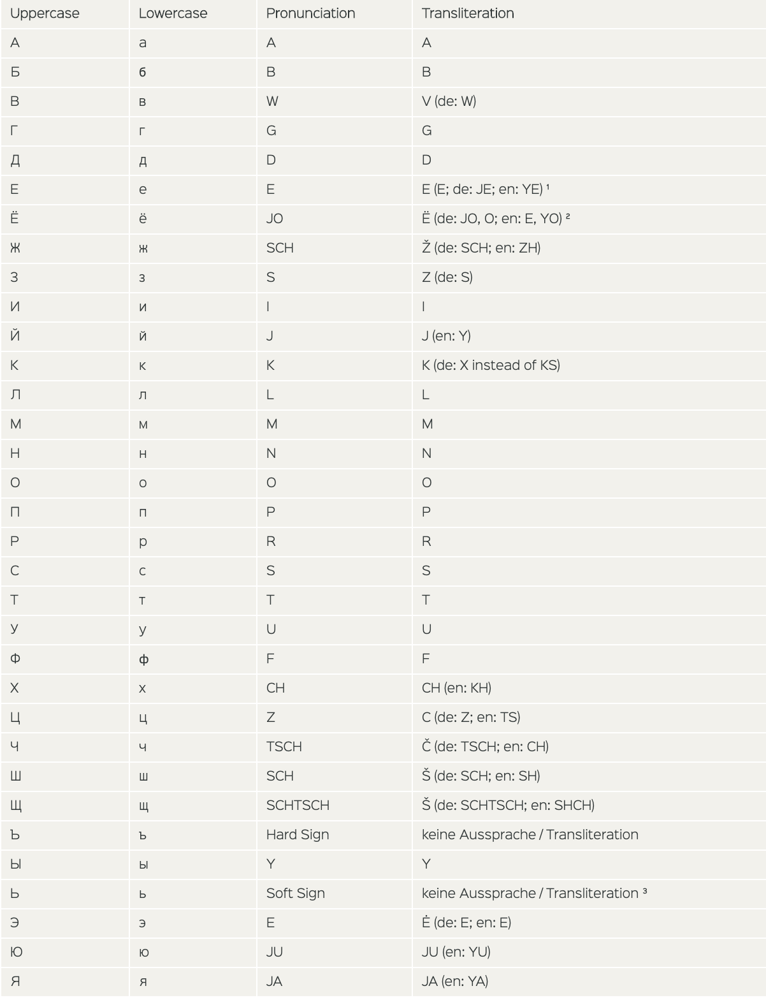

# Russian





## Learning russian via frequencies


## log

- One nice way to learn russian letter pronounciations is to practice saying them, you'll think which words are pronounced in what way, and thereby learn it.
It's okay if you skip the meaning of the sentences as you go through the pronounciation, the goal is to be able to pronounce any russian words.

setup:
```bash
sudo pip install nltk

# in python:
import nltk
nltk.download('all')
```

The idea is to have an app, that have flashcards (similar to kindle), exposing meaning and sound of the words. You can have various languages in there, but initially it should just be Russian. 
It's not only words, but also 2-grams, 3-grams etc.  
For 1-grams, you should do lemmatization.


## interesting stuff
- The consonant letter й  is sometimes called a semivowel.
- Russian have [prepositional case](https://www.duolingo.com/skill/ru/Where-is-it%3F/tips-and-notes)  
This is unclear - So in English, the preposition just decided the meaning. But in Russian the `preposition+noun(with it's case)` decide what the meaning is. 
- russian has 6 cases.
- Russian words often have random gender assigned to them
- Russian doesn't have articles - a, an, the

kak - similar, as, how
tak - that/so
