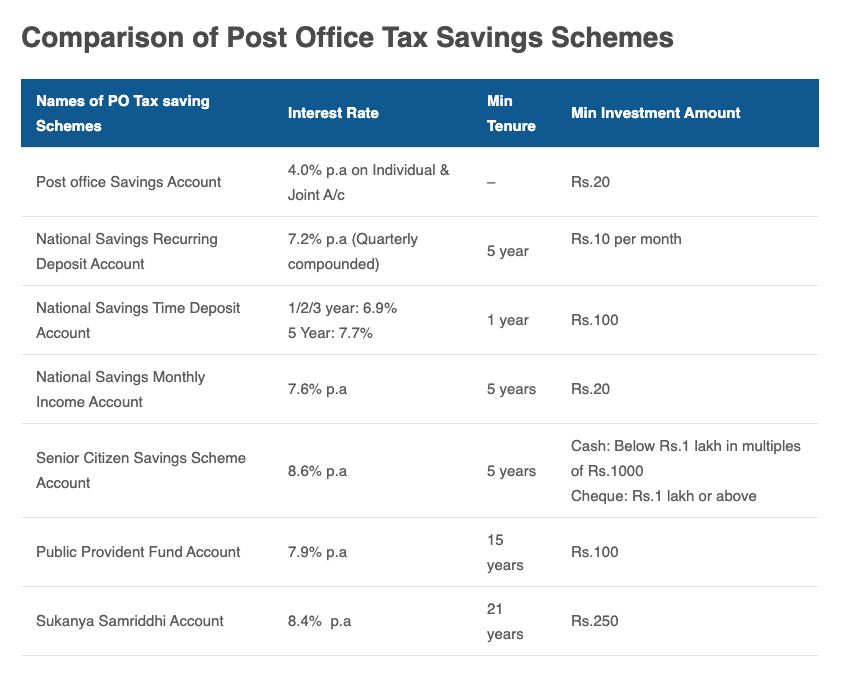

# Government Schemes

## Public Provident Fund (PPF) 
Is a tax-free saving scheme regulated by the Indian Government. It is a long-term investment scheme with a **lock-in period of 15 years**. Individuals can start investing in PPF with a minimum amount of Rs. 500 p.a. The interest rate is set and paid by the government for every quarter. PPF interest rate for the third quarter of the year 2020-21 i.e. from 1st October to 31st December is fixed at 7.1%. 

## Post office savings schemes
- resource: [paisa bazaar](https://www.paisabazaar.com/saving-schemes/post-office-tax-saving-scheme/)

