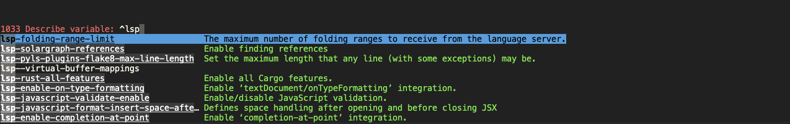

# Specific emacs modes

## spelling checks

I like flyspell-mode along with ispell for spelling checks

enable `flyspell-mode`, and then `flyspell-buffer` to look at all spelling errors in buffer.  
Invoke `ispell` or `s-:` to start spell check - accept a suggestion or insert to dictionary (`i`)


## xah math input
I use [xah math input](https://github.com/xahlee/xah-math-input) to input mathematical symbols. For example, type 'and' and then press 'Shift-SPC' to get the conjunction symbol


## helpful

`helpful` package can give better exploration of variables, functions etc.
```elisp

(use-package helpful
  :custom
  (counsel-describe-function-function #'helpful-callable)
  (counsel-describe-variable-function #'helpful-variable)
  :bind
  ([remap describe-function] . counsel-describe-function)
  ([remap describe-command] . helpful-command)
  ([remap describe-variable] . counsel-describe-variable)
  ([remap describe-key] . helpful-key))

```


Say you want to explore lsp variables, you can do `C-h v`, you get:




## flyspell

`flyspell-auto-correct-previous-word`: `C-;`
and `flyspell-auto-correct-word`: `C-M-i`
