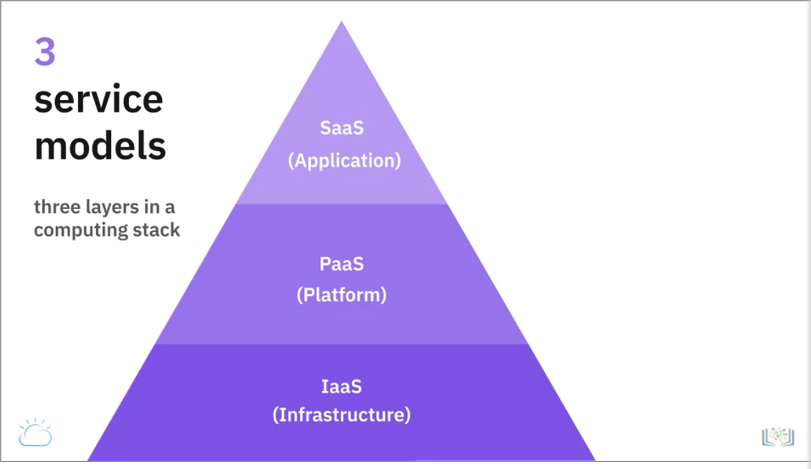

# Cloud computing

on-demand network access to a shared pool of configurable computing resources

## 5 essential characteristics
- on-demand self-service : no human interaction required
- broad network access: can be accessed via network via standard methods like mobile, tablets, laptops etc.
- resource pooling: multi-tenant model - resources are pooled and assigned/reassigned to users depending on demand
- rapid elasticity: resources are elastically provisioned and released
- measured service: pay for what you use

## Cloud deployment models
- public  
leverage cloud services over open internet on hardware owned by cloud provider, but its usage is shared by other companies
- private  
provisioned for exclusive use by single org. Can be run on premises or it could be owned, managed and operated by a service provider.
- hybrid  
mix of both public and private clouds.

## Service models

- IaaS : infra and physical computing resources such as server, networking, storage and data center space [without needing to manage or operate them]
- PaaS: get access to hardware and software tools, using which you can develop/deplot apps over the internet.
- SaaS: software licensing and delivery model in which software and apps are centrally hosted and licensed on a subscription basis ["on-demand software"]
