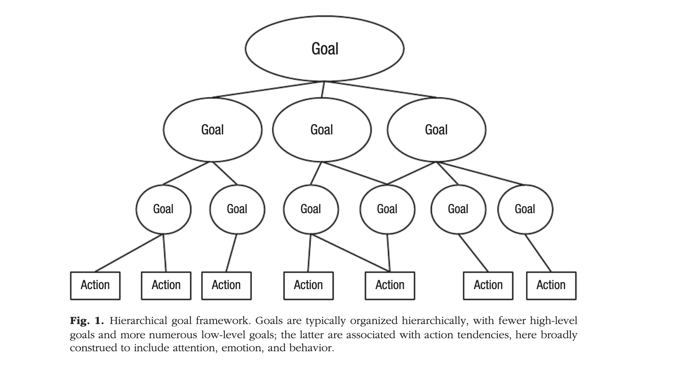
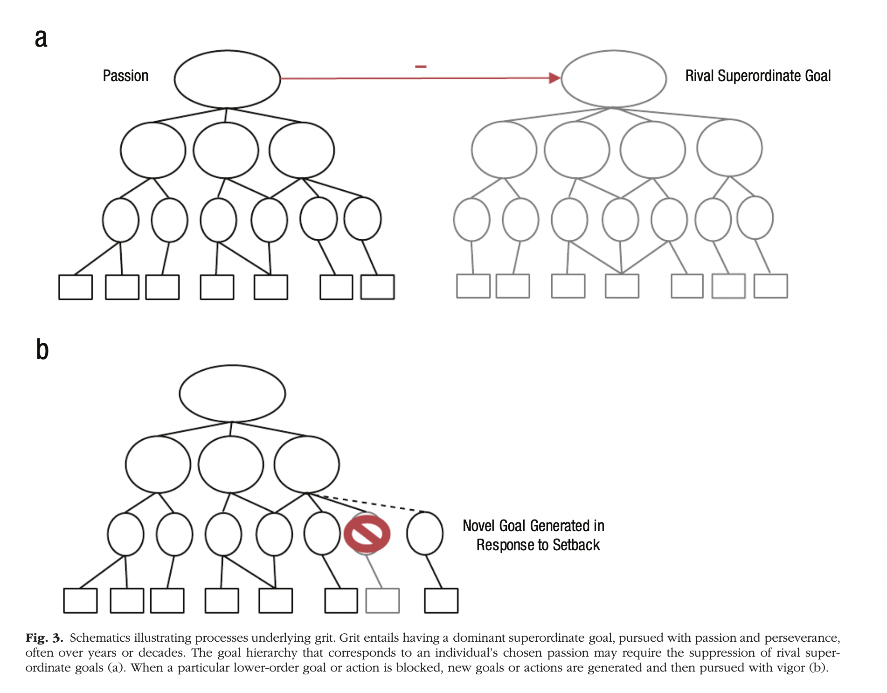

# Self-Control and Grit

Firstly, the concept of two pillars of long term expertise - self-control and grit

Self-control is applied at a daily level, making sure that you consistently choose tasks that align with your long term goal. It's delayed gratification applied. Sometimes you might feel like pursuing an alternate goal which will bring immediate satisfaction, but is not well aligned with a larger long-term objective. Self-control is about minimising these. 

Grit is the tenacious ability to continue working on a dominant long-term objective despite setbacks. It's what establishes harmonious passion (i.e. the autonomous internalisation of a specific activity into the personality or identity)

Secondly, be the change you want to see in the world.

What are the changes you'd like to see in your own life. What's the way you want to live it. It's not about changing the world or nation, that's egoistic. Life is here. Transform your own room, before you set out to fix the world. This is the grassroot level change which'd trickle up into massive change in the world.

### Self-control: resisting temptations at an hourly level

Our capacity to exercise self-control tends to increase as we age because of the maturation of prefrontal cortex (which regulates self-control). 

### Grit

"grit predicts high achievement by inclining individuals to both show up and work very hard, continuously, toward a highly valued goal for years and even decades"

### A hierarchical goal framework

 

Lower goals serve the higher goals. The lower goals are at a more fine-grained level, context specific, short term and substitutable. Whereas higher order goals are typically fewer in numbers, more abstract, more enduring, and more important to the individual. 

within this framework, self control refers to the ability to resolve between conflicting action impulses - one related to a goal more valuable in the moment; the other of more enduring value. You can either modulate your action impulses in the heat of the moment, or deploy effective cognitive and behavioural control strategies to guide you choose goals of more enduring value rather than choosing what merely advances fun. 

individuals are either able to suppress rival superordinate goals (consistent with descriptions of eminent productive individuals who lack alternate superordinate goals all together). 

In case of setback, a new lower level goal is generated (which complies with the superordinate goal) and pursued with vigour.

Viewed with this framework, self-control and grit are both needed to protect value goals. Where they differ is in the nature of the enemy and timescale involved. Self control is required to adjudicate between two lower level goals. Grit ensures years or decades of allegiance to the highest level goal despite setbacks. Self control is coupled with daily success, whereas grit is coupled with exceptional achievements that take years, decades or lifetime.

---

link: 

[Self Control and Grit: Related but Separable Determinants of Success](https://fermatslibrary.com/s/self-control-and-grit-related-but-separable-determinants-of-success)

[more papers on grit and self-control](https://scholar.google.com/citations?user=LyU6HSYAAAAJ&hl=en&oi=sra)
