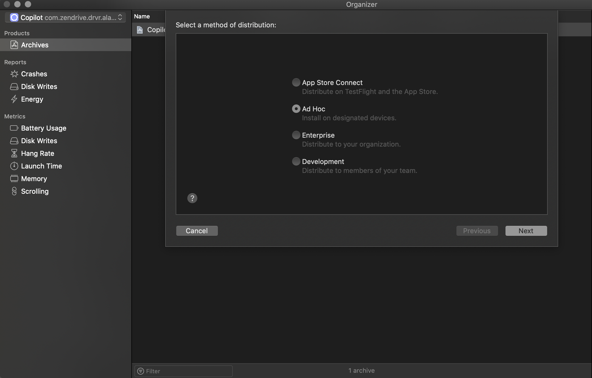

# Code Signing

Resource: [Beginner's Guide to iOS Provisioning Profiles](https://blog.theodo.com/2017/02/a-beginners-guide-to-ios-provisioning-profiles/)

In-house apps can be created through **Apple Developer Enterprise Program**.

Focusing on app store apps here:
- In iOS, you can't install an app on any device. It has to be signed by Apple.
- However when you are developing the app, you want to test it before sending it for approval from Apple. Provisioning profiles are a 'temporary visa' which allows you to do that.

There are 3 components to talk about before [provisioning profiles](#prov-prof) -  
1. [Certificates](#certificates)
2. [App identifiers](#app-id) (App Id);  
3. [List of devices](#list-of-dev) an app can run on  

### Certificates

Essentially, a public/private key-pair, which identifies who developed the app. 
You can specifiy the software/distribution type you want the certificate for. Certificates can also be of `Services` type, which is required to enable capabilities like push notifications/apple payment/voip etc.

Check out:  
[Software types](static/certificate_software_type.png)  
[Services types](static/certificate_services_type.png)

For provisioning profiles (??), the key ones are:

1. `iOS app development`
**Development certificate** for testing the app on physical device while writing code.  
Development certificates can be created by 'Members' of the iOS Development team.
2. `App Store and Ad-Hoc`
**Distribution certificate** - For when you are ready to give app to people -- first for testing (ad-hoc) and then for distribution via Testflight/App store.  
Distribution certificates can be created only by the 'Admins'.

Once you select one, you'll need a `Certificate Signing Request` from your mac - this provides the public/private key (??)

### App ID

- It's a category of `Identifier`. If you want your app to use available capabilities and/or identify the app in a provisioning profile, you should register an app id.  
Other kinds of [Identifiers](https://developer.apple.com/account/resources/identifiers/add/bundleId) include App Groups, Maps ids, iCloud Containers etc.
- Two types: App or app clips
- **explicit bundle ids**: Recommended to use a reverse-domain name style string (com.domainname.appname)
- **wildcards**: example com.domainname.\*  
Wildcards only have a limited set of capabilities to enable.
- Example of `capabilities` are: App groups, in-app purchases, push notifications, sign in with apple etc.

### List of devices
- This is an annoying part - you've to get the UDID (Unique Device Identifier) of the device you want to add. They'll have to connect to a computer and find UDID from itunes.  
- Another way is to use [whatsmyudid.com](http://whatsmyudid.com/)
- UDID is a 40 character hexadecimal string.

### Provisioning Profiles

Few major kinds:

- ##### iOS App development
for testing on a physical device while developing.
- ##### Ad Hoc  
For distributing app to non-TestFlight testers (e.g. via <e606a74e> or Firebase)  
To run app signed from this profile, the user has to trust the apps from developer in `General -> Profiles and Device Management`  
Still need to indicate the allowed devices.
- ##### App Store  
For distributing via TestFlight or app store.  
this won't work on its own, the app will still need signing by Apple to work.
- ##### In House (or Enterprise)  
List of devices is not needed here, which makes it very convenient for large organizations to distribute the app in-house.

* A Note on apple membership - <06e19721>

Teams (??) share identifiers space, which means one identifier can only be present in one team.

