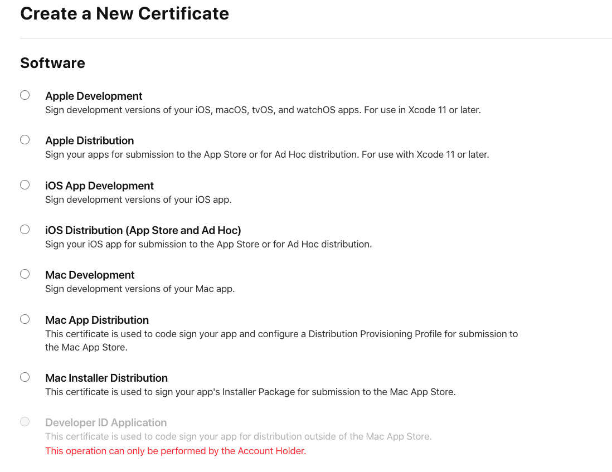
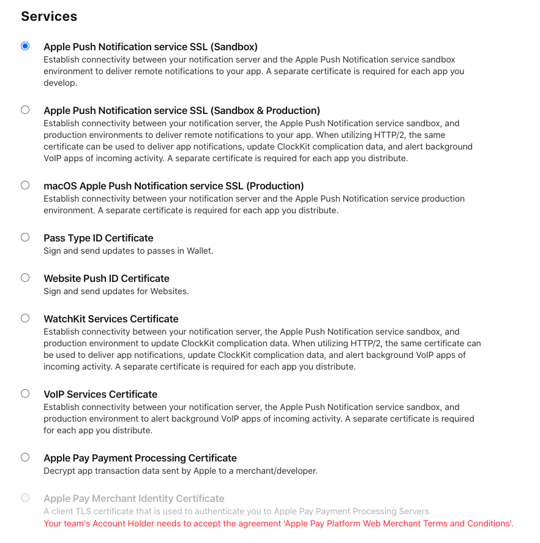

# Code Signing

Resource: [Beginner's Guide to iOS Provisioning Profiles](https://blog.theodo.com/2017/02/a-beginners-guide-to-ios-provisioning-profiles/)

In-house apps can be created through **Apple Developer Enterprise Program**.

Focusing on app store apps here:
- In iOS, you can't install an app on any device. It has to be signed by Apple.
- However when you are developing the app, you want to test it before sending it for approval from Apple. Provisioning profiles are a 'temporary visa' which allows you to do that.

## Provisioning Profiles
 
- There are 3 components here - 
**certificates** (which grant apps some capability); 
**app identifier** (App Id); 
**list of devices** an app can run on.

### Certificates

If a public/private key-pair, which identifies who developed the app. 
You can specifiy the software/distribution type you want the certificate for. Certificates can also be of `Services` type, which is required to enable capabilities like push notifications/apple payment/voip etc.

For provisioning profiles (??), the key ones are:

1. `iOS app development`
**Development certificate** for testing the app on physical device while writing code.  
Development certificates can be created by 'Members' of the iOS Development team.
2. `App Store and Ad-Hoc`
**Distribution certificate** - For when you are ready to give app to people -- first for testing (ad-hoc) and then for distribution via Testflight/App store.  
Distribution certificates can be created only by the 'Admins'.

Once you select one, you'll need a `Certificate Signing Request` from your mac - this provides the public/private key (??)

### App ID

- App identifier. If you want your app to use available capabilities and/or identify the app in a provisioning profile, you should register an app id.
- Two types: App or app clips
- **explicit bundle ids**: Recommended to use a reverse-domain name style string (com.domainname.appname)
- **wildcards**: example com.domainname.\*  
Wildcards only have a limited set of capabilities to enable.
- Example of `capabilities` are: App groups, in-app purchases, push notifications, sign in with apple etc.
