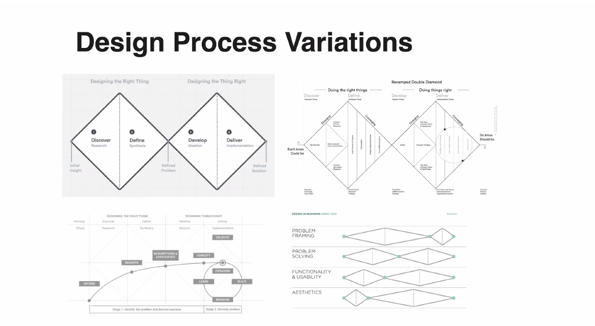

# daily-notes

# Design

Garret's Anatomy of a design: surface, skeleton, structure, scope, strategy

Design Process:
- initial uncertainty is high during research. Then we form concept, prototype, and then clarity is achieved.

Lots of companies take this as base, and then tweak it (for example: time spent on each stage).

## Generate ideas

* HMW questions
For ideation sessions.
How might we ___ for ___.

* Brainstorming: Leveraging ground synergy to build on others' ideas.

# History of self esteem (The Good self)
We look to track where the idea of self esteem and "authentic self" from. 
The Esalen institute is a non-profit retreat center and internation community residing in California, on the cliffs overseeing the Pacific ocean. The intention was to explore human consciousness via alternative methods. It played a key role in the cultural tranformations of 1960s, introducing many ideas that later became mainstream.  
America had been settled by Calvinists who lived under a system of 'socially imposed depression'. They lived under the shadows of old gods, and when they finally did severe this connection, a radically new idea too its place. The founding document, the Declaration of Independence, stated - "All men are created equal, that they are endowed by their creator with certain unalienable rights, that among these rare life, liberty and the pursuit of happiness".  
Humans were seen as inherently good, and even though at the base level we are animals, it's still "positive" in nature. 
Of course, for people to truly change, there has to be a shift in how they 'got aling and got ahead'. The 19th century was a time of great economic revolution, in which fiscal opportunities exploded into spaces other than agriculture. The Patent system is one example of this - it prompted many inventors to, well invent, and get rich.

## Chasing Knowledge
I'm interested in a myriad of things and have invested a significant amount of time reading books and blogs, watching lectures and so on. It makes me wonder if I can improve this process of amateur scholarship which is so very vital for me. I wonder what is the best way to think about this...this is slightly uncomfortable, because I don't know how to proceed.
- Probably the first thing to decide is what's exciting to you? It might not be what has worked in the past, or even something you haven't thought.
- I get the most satisfaction when some curiosity of mine is annihilated. When I have mastery over it, and understand the system through and through. Zoom in or zoom out, I can wrap my head around it. 
- It's primarily a way for me to see more detail of the world, a way to ask more and more questions and not remaining oblivious to what's around. Science is a fascinating thing. More generally, curiosity is an awesome force. 
- I seek to be a generalist with varying degrees of knowledge/expertise in different areas. It spews forth so many ideas, and your head remains a wonderful place to reside in.

## Upgrading your wetware
Learning is a life-long engagement, and like anything worth doing, can be done in better ways. It takes time and effort to learn, and therefore being more efficient at it is obviously desired.
- *A knowledge incorporating system*  
A system is needed which can allow things read/learned to be incorporated into the mental models. It should be easy to see how the new bit of information fits in with already existing ones (reconsolidating). It should also be easy to revise and revisit the pieces.  
One open question is: When to take notes (don't make me a note-taking monster vs ensure that the notes are plenty enough to be useful; capturing bits of insight more detailed than mere headings). What exactly is the process?

- *Writing*  
As a form of self expression and communication, it should become clearer, more engaging and useful. As a way to journal and think clearly, it should be used more and more often, and to a fuller extent.
- *Reading*  
Reading any text at the right speed is a skill that can be developed. `Skimming` for example is a basic exercise and should be performed regularly to keep it sharp. Comprehension and understanding needs to be deliberately practiced as well.
- *Being ferociously interested*  
It's necessary to be interested in what you are working on. Slogging your way through with stubborn willpower is suboptimal, and will breed discontent, leading you to become suspicious of your endeavors, or worse quit them.   
Cultivate curiosity. Notice confusion. Try hard to find what's interesting about something.

### Learning is an end in itself, and also a part of something bigger
- Learning is about engaging curiosity and annihaliting it. But it's also meant to be a birthplace of many a hacks!
- Strive for expertise, so you have more impact. Strive for impact, so you have more expertise.
- Hands-on imperative. Define your project. This is not a place to doodle.
- Open-source and big-impact areas in your company are obviously great places to code and do things. Exploring interesting things (and blogging) is another.
- Hacking is however not limited to programming - Understanding and using gamification in parts of your life can be an interesting experiment.

## Replacing guilt
Personal list to remove it:
- Eat your frog first thing in morning
- Work on what truly matters
- Have good defaults e.g. calling people up, rather than playing video games.
- Exercise if you aren't starting anything because you are feeling lethargic
- Meditate if feeling overwhelmed

Notes from `Replacing Guilt`:

### You don't know what you're fighting for (exactly), you can only know the general direction.

- replacing feeling guilty about doing nothing (listless guilt), to feeling guilty about not doing something in particular - this is easier to address.
- Your values/preferences are a result of millions of years of complex evolution and are influenced in myriad ways by thousand years of culture. It's almost naive to expect them to be simple. They are a multitude of desires smashed together by Time.  
It's therefore skeptical to claim when someone says that they know what they want through and through.  
It's not that your values are inherently unknowable, if you live long enough, you can probably map out the territory. But we don't know them yet.
- But that doesn't mean we are throwing darts in the dark. We have a hell lot of evidence for our values (preferring pleasure over pain, for example). 
- You don't know exactly what you're fighting for, but the world's is in bad enough shape that you don't need to.
- To overcome listless guilt, know what you are fighting for, but the caution is that you probably might not know exactly what that means. You will know what direction the arrow is pointing towards though.

### Caring about something larger than yourself
- Self is complex, a multitude of conflicting interests.
- Many of these interests (like ingroupism) was relevant for ancestral environments, but is not so relevant now. It might also infact stand against your aesthetic sense of justice and fair play (the kind of stuff Buddhism asserts).
- You might think that you don't care about people outside your social group. But is it really true? Are you confusing caring and feeling?
- It's possible to not feel anything for a person, and still care for ze (as much as you do for your friends, if not more).
- The question remains as to why you would want to do such a thing. 

## Will two ideal rationalist always agree?
No. Because the two might have different value systems, and that can cause them to agree to different paths. 

## Accurate science fiction:
https://astrosociety.org/file_download/inline/621a63fc-04d5-4794-8d2b-38e7195056e9

## The Almanack of Naval Ravikant
### To avoid competition, be authentic
People compete when they seek to be like everyone else.  
This is the best time to offer something no one else can.  
Become the best in the world at what you do. Keep redefining what you do until
this is true.  
Work as hard as you can. Even though who you work with and what you work on are more
important than how you work.
### What are your core strengths? Are you the best at it? 
Work iteratively towards being the best at it.
### Applied Scientists are the most powerful people in the world.
It'll be more obvious in coming years. Downstream to it is technology.
Further downstream is society, business and money.
### Learn
Study: Microeconomics, game theory, pschology, persuasion, ethics, maths, computer science
Reading is faster than listening. Doing is faster than watching.
### Becoming rich
To become rich you must have equity, a piece in a business, which'll earn you money even 
when you are sleeping.
### Foundations are superimportant
- Basic arithmetic and numeracy > calculus
- convey youself in simple english >> knowing 7 different foreign languages.
- Knowing how to be persuasive when speaking >> being an expert digital marketer
- You can only achieve mastery in one or two things. It's usually the things you're obsessed about.
### Compound interest
- All the returns in life, whether in wealth, relationships or knowledge, come from compound interest.
- Someone might be as talented as you, but if ze has worked on having a sterling reputations, and kept 
building it year after year, ze's going to be worth vastly more than you.
- This is also true when working with individual people.
- When you find the right thing to do, when you find the right people to work with, invest deeply.
### 99% of effort is wasted.
- Obviously, nothing is ever completely wasted because it's a part of the learning experience. In school, the 
exams, projects and exercises you did, geography and history lessons learned etc. are never really applied 
to a significant degree in what you are doing today. 
- But of course, these are learning experiences, you learned the value of hard work. Somethings might have seeped
deep into your psyche. But when it comes to the goal-oriented life, only 1% of the efforts you made paid off. 
- Same is true for dating. Until you met your husband/wife, all the other people were wasted time in the goal 
sense. Not wasted in exponential sense, not wasted in learning sense, but wasted in goal sense.
- This is a reminder to be thoughtful and realize that in most things (relationships, work, learning), what you're
trying to do is find that thing you can go all-in to earn compound interest.
- It's not that we shouldn't do the 99%, because it's hard to identify what the 1% is. Instead: when you find that 
1% of your discipline that will not be wasted, you'll be able to invest in it for the rest of your life. You can 
go all-in. Forget about the rest.

