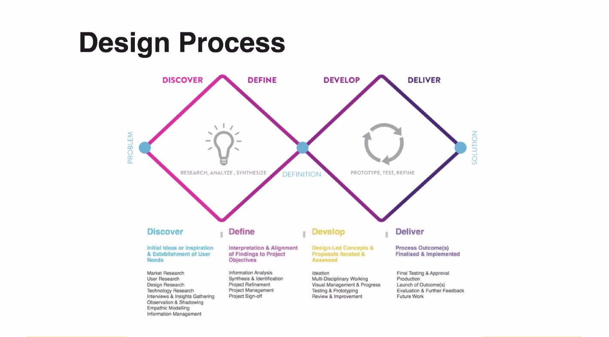

# daily-notes

# Design

Garret's Anatomy of a design: surface, skeleton, structure, scope, strategy

Design Process:
- initial uncertainty is high during research. Then we form concept, prototype, and then clarity is achieved.

Lots of companies take this as base, and then tweak it (for example: time spent on each stage).

## Generate ideas

* HMW questions
For ideation sessions.
How might we ___ for ___.

* Brainstorming: Leveraging ground synergy to build on others' ideas.

# History of self esteem (The Good self)
We look to track where the idea of self esteem and "authentic self" from. 
The Esalen institute is a non-profit retreat center and internation community residing in California, on the cliffs overseeing the Pacific ocean. The intention was to explore human consciousness via alternative methods. It played a key role in the cultural tranformations of 1960s, introducing many ideas that later became mainstream.  
America had been settled by Calvinists who lived under a system of 'socially imposed depression'. They lived under the shadows of old gods, and when they finally did severe this connection, a radically new idea too its place. The founding document, the Declaration of Independence, stated - "All men are created equal, that they are endowed by their creator with certain unalienable rights, that among these rare life, liberty and the pursuit of happiness".  
Humans were seen as inherently good, and even though at the base level we are animals, it's still "positive" in nature. 
Of course, for people to truly change, there has to be a shift in how they 'got aling and got ahead'. The 19th century was a time of great economic revolution, in which fiscal opportunities exploded into spaces other than agriculture. The Patent system is one example of this - it prompted many inventors to, well invent, and get rich.

## Projection bias

This is a bias equivalent of "short-sightedness". When taking current decisions (which has future implications), we tend to project our current emotions to the future i.e. people's estimations are contaminated by their current emotional state. For example, after a student fails his exams, ze is likely to underestimate how much ze will enjoy a party 3 weeks from the results.  
Projection bias can arise from **empathy gaps** - basically when a person fail to take the future psychological state into account.
A similar concept is Personality neglect, which refers to a person's tendency to overlook their personality when making decisions about future emotions.  
Projection bias influences the lifecycle of consumption. The immediate utility obtained from consuming the project exceeds the future utility. So people tend to consume too much early in life, and too little late in life, relative to what would be optimal.

## Hot cold empathy Gap
It's a cognitive bias which happens because we underestimate the influence of visceral emotions (anger, hunger, drug addition etc.) on their attitudes, behavior and preferences. One important aspect of this idea is that human understanding is "state-independent". For example: when you are angry, it's difficult to imagine what it's like to be calm and vice versa.  
Hot-cold empathy gaps can be analyzed by their direction:
- Hot to cold: People under visceral influences find it difficult to estimate how much their short term goals align with long term goals.
- Cold to hot: Difficulty in imagining oneself in a hot state. The motivational strength of visceral strength can be minimized. Unpreparedness (when visceral emotions actually arise) is another effect.
