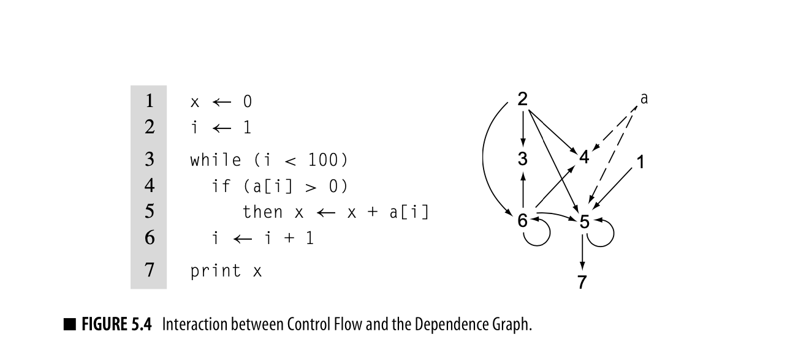

# Intermediate Representation


## Introduction

- Natural language has ambiguities. Progamming language shouldn't have any ambiguity. Ambiguous statements have no meaning.
- interpreters take a executable specification, executes it and returns the output. Compare with compilers, which takes one executable specification and converts to another executable specification.
- mixed modes are there - Java compiles into bytecode, and then this is interpreted by the JVM. For more complicated examples, consider Some implementations of JVM which include a JIT which compiles the bytecode into machine executable instructions at runtime.
- Techniques to analyze whole programs are moving from compilation to linking time, where the entire compiled codebase is available, which opens up new insights which were not present at compile time. Similarly, compiler are being invoked at runtime to generate native instructions with knowledge which were not simply present at compile or link time.
- The optimizers can have several objectives - fast compilation, smaller executable size, lesser page faults, less energy usage.
- optimizations: consists of analysis (if a particular transformation will be 'efficient') and transformation.
Data flow analysis, reasons the flow of code at runtime.
- *Instruction selection*: maps each IR operations, in its contect, into one or more target machine operations. The IR often assumes infinite registers (virtual registers) and relies on the register allocator to map to actual registers of target machine.  
Instruction selection can take advantage of special operations on target machine, for example:  

```bash
# Instruction
a = a * 2

# IR:
load 2 -> r2
load a -> ra
mult ra, r2 -> ra

# can be change to:
load a -> ra
add ra, ra -> ra
```

- Register allocation: mapping the virtual registers to actual target machine registers. The #registers used to execute a set of instructions is to be minimized (although you might used extra registers in case it helps you to reduce #instructions or reducing the #cycles needed to execute all instructions.)
- Instruction scheduling: Reordering the instructions to execute instructions faster. Many processors have the property to execute new operations while a long-latency operation (like load) executes. Until the paralleling executing instructions depending on the value being loaded, they can execute freely. However, if there's a dependency, the execution will wait until the long-latency operation completes.  
As it can be seen there's a balance to be struck between resgiter allocation and instruction scheduling. This is one of the examples of interactions among code-generation components.

## Intermediate Representations

- Compiler is often arranges as a series of passes. Each pass inputs/outputs some intermediate form with additional information augmented to it (Except the scanner which inputs the source code).
- IR often needs to have more details about the program. They are augmented by various tables that record these additional information. These information will then need to be passed to the next stages of compilation, so that the program can be made better.
- IR can be closer to source code (in source-to-source translators) or closer to asm when you need to output to a particular microprocessor.
- Divided structurally, IR can be Graphical (parse trees, ASTs) or Linear (resembling assembly) or Hybrid (blocks of linear code linked together in a graph indicating flow of control)
- Second axis of the taxonomy is the *level of abstraction* at which the IR represents the operations. Parse trees for example are much near to the source code. Whereas three-address codes are nearer to assembly.
  - The representation will determine what kind of optimizations are easily possible. For example: Instruction scheduling optimizations are easier in near-assembly IRs, whereas the source-level tree makes it easy to find and compare array references.
  - Not all tree-based IRS use a near-source level abstracction. Many C compilers have used low-level expression trees. Similarly many linear IRs can have relatively high-level constructs like min/max/string copy.
- The third taxonomy deals with the name space used to represent the values in the code. It has a strong effect on how optimization can improve the code.

### Graphical IRs

#### Syntax-Related Trees
  - Parse Trees:  
  Think of it as a graphical representation of the parsed statement with intermediate nodes being non-terminal terms from the expression grammer.  
  Many useless nodes are present which do not directly participate in compilation. => *Worth shrinking down.*
  - AST: The parser can build the AST directly.  
    The level of abstractions that ASTs contain depends on the goal of the compiler - Source-to-source systems often use AST from which source code can be easily regenerated. Whereas, if assembly is the aim, the ASTs will contain much lower level info.
  - DAG: ASTs with redundancies eliminated. e.g. `a X 2 + a X 2 X b`, here `a X 2` is calculated twice. DAG can expose this redundancy. It of course has to prove that the statements are indeed redundant (if the expression don't contain assignments or function calls etc.).  
  The level of abstraction exposed in a tree matters since compilers can, in general, only perform optimizations using the details exposed by the IR.

#### Graphs
Trees provide a natural representation of grammatical structure of source code. But their rigid structure makes them less useful for representing other properties of the program.

- Control-Flow Graph
  - Basic blocks: a group statements which have no branching. In a CFG, each basic block is a node, and each basic block has either indegree or/and outdegree greater than 1.
  - CFG is often used in conjunction with another IR like linear of expression-lvel AST etc (hybrid IR).
  - Some recommend using a shorter segment than basic block. A common alternative is *single-statement block*: block of code corresponding to a single source-level statement.  
    Single statement block would result in more nodes, and so take more space and time to construct and analyze.
  - Instruction scheduling uses CFG to find how the scheduled code for individual blocks flows together. Global register allocation relies on a CFG to understand how each operation might execute and where to insert loads and stores for spilled values.
  
- Dependence Graph



  - Captures the flow from when a variable/register is defined to when it is used. The edges are from "defined"->"usage" or "usage"->"usage"
  - Source: You can create a dependence graph from source code or from linear IR.
  - Usages in instruction scheduling and variety of optimizations.
    
- Call Graph
To address inefficiencies that arise across procedure boundaries, some compilers perform interprocedural analysis and optimizations. A call graph has nodes as procedures and edges as procedure-to-procedure call.  
Some complications arise:
  - Separate compilation (each file or small component is compiled independently) makes it difficult to consider the multiple-file program as a whole. Some compilers build partial graphs and optimize across that set.
  - Procedure-valued parameters: When arguments are some lambdas, those might end up calling different functions at different times, which make compile time evaluation difficult. 
  - OOP with inheritance makes procedure calls ambiguous. Extra type infomration is needed, and in some cases it cannot be known until runtime. 
  
  

### Linear IRs


### Books used
- Engineering a Compiler 2nd Editions (K. Cooper, L. Torczon)

