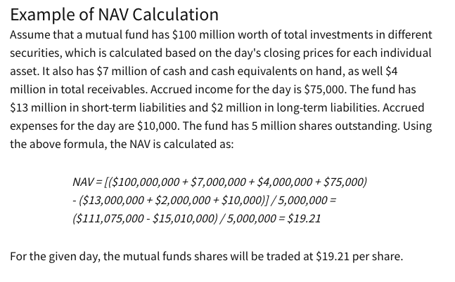

# Mutual Funds

Further topics: <6775d9d0>

## Open Ended Mutual Funds
- An open ended mutual funds can issue shares as long as the buyers want them. It's always open to investment. While buying shares adds new shares, selling shares takes them out of circulation.
- Shares are bought and sold on demand at their Net Asset Value (NAV).
- The money is pooled from various investors, and purchase a diversified portfolio reflecting a specific investment objective (growth/income, large-cap/small-cap, specific industries)
- Occassionally, if the fund's investment management determines that the fund's total asset have become too large to execute its state objective effectively, it's closed to new investors.
- Fund manager will often keep a percentage for the active investing ze's doing.
- They also have to keep some cash aside for when people want their money back.

### An example
- So if a fund has 400$ for a net 4 shares, and I go in and buy one share. Now the NAV is 500$, spread over 5 shares. Note that the value of existing shares do not change from buying.
- If after an year of investing by the manager, if the NAV goes upto 1000\$, now each share is worth 200\$. At this point let's say you want to take out a share, this makes the current NAV to 800$ while the number of shares now is 4.  
Note that the value of existing shares do not change from selling.

## Closed-end mutual funds
- Share structure is locked in from beginning
- If you want your money back, you've to sell it someone else (in a secondary market). The Fund is not involved in selling/buying.
- Did not have to keep cash aside, and fund manager doesn't have to interact (buy/cell) with investors on a daily basis (so lower fees).

## Exchange traded funds (ETFs)
- Best of open-ended and closed-ended funds.
- Only some parties (large institutes) can buy/sell big block of shares.
- Fund manager doesn't have to deal with small transactions.
- People can buy shares from these large institutions on the open markets.
- In general have lower fees, because it doesn't have to deal with daily transations + it's not actively managed.
- Can be traded at any time of the day, rather than waiting for end of day like open-ended mutual funds.

### Asset Mix
- Breakdown of all assets within a fund or portfolio.
- Broadly, assets can be one of these core classes: stocks, bonds, cash, real estate.
- Fund managers provide investors with percentages invested by each asset category in the portfolio.
- This is a key deteminant of risk/reward profile of the fund. It can also provide insight into long term performance expectations.

### NAV
- `NAV = (Assets worth  - liabilities)/#available shares`. 
- NAV/share is for how much you can buy or sell each share of the fund.

