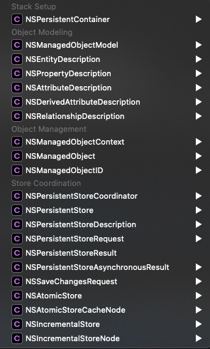

# Core Data

## Intro

Core data is first and foremost an **object graph manager**. It is the **M** in **MVC**. Persistence is just an optional feature. It also has a number of other features like input validation, data model versioning, change tracking.

### Core data is not a database / Coredata vs SQLite is the wrong question
- If you need to managed complex object relationships, core data is a great choice. For lightweight model layer OR a SQLite wrapper, core data is not what you need.  
- Core data provides an abstraction which allows you to deal with the records in an object-oriented manner.
- Core data is responsible for the integrity of object graph (??)

### Core data drawbacks
- #### Performance
Core data has to load the records in memory to perform operations on it. This is because the operations have to performed on an object (that is the core data interface for the records). This means that to delete a 1000 entries, you'll have to load them in memory. Compare this to SQLite, where deleting records is a SQL query.
- #### Multithreading
The framework expects to be run in a single thread. Various solutions have developed over the years though.

## Components

### Managed Object Model : NSManagedObjectModel
A programmatic representation of the data model file(`.xcdatamodeld`) describing your objects. It's a collection of several entities (NSENtityDesciption object) representing the entities of the schema. Entities have attributes and relationships.

### NSEntityDescription
A schema for a managed object (to use a database analogy, what tables schemas are to corresponding rows, an entity description is to managed object)

### Managed Object : NSManagedObject
Representation of core data records.

### Managed Object Context : NSManagedObjectContext
- An object space containing multiple model objects (NSManagedObjects). 
- It's a layer over a parent context (which is either a persistence store coordinator or another managed object context). It manages the lifecycle of NSManagedObjects within it (save/rollback/fetch etc.) Any save or fetch happens from the parent context.  
- It uses thread confinement (belongs to the thread which init'ed it), and therefore should not be passed around in threads. Instead pass the persistence controller and create a new MOC in the new thread.

### Persistent Store Coordinator : NSPersistentStoreCoordinator

### NSPersistenceContainer
Encapsulates the core data stack. One stop solution to create the core data stack components - persistence coordinator, managed object model, managed object context.

---
References:
- [cocoacasts](https://cocoacasts.com/exploring-the-core-data-stack)
- [apple core data documentation](https://developer.apple.com/library/archive/documentation/Cocoa/Conceptual/CoreData/index.html)
