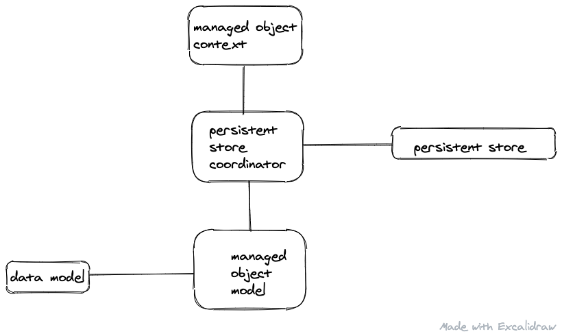

# Core Data

## Intro

Core data is first and foremost an **object graph manager**. It is the **M** in **MVC**. Persistence is just an optional feature. It also has a number of other features like input validation, data model versioning, change tracking.

### Core data is not a database / Coredata vs SQLite is the wrong question
- If you need to managed complex object relationships, core data is a great choice. For lightweight model layer OR a SQLite wrapper, core data is not what you need.  
- Core data provides an abstraction which allows you to deal with the records in an object-oriented manner.
- Core data is responsible for the integrity of object graph (??)

### Core data drawbacks
- #### Performance
Core data has to load the records in memory to perform operations on it. This is because the operations have to performed on an object (that is the core data interface for the records). This means that to delete a 1000 entries, you'll have to load them in memory. Compare this to SQLite, where deleting records is a SQL query.
- #### Multithreading
The framework expects to be run in a single thread. Various solutions have developed over the years though.

## Components

### Managed Object Model : NSManagedObjectModel
A programmatic representation of the data model file(`.xcdatamodeld`, which is compiled to `momd` - managed object model document) describing your objects. It's a collection of several entities (NSENtityDesciption object) representing the entities of the schema. Entities have attributes and relationships.

### NSEntityDescription
A schema for a managed object (to use a database analogy, what tables schemas are to corresponding rows, an entity description is to managed object)

### Managed Object : NSManagedObject
- Representation of core data records.
- A managed object is *always* associated with a managed object context.
- when you make changes to managed object, and want to persist it, you need to save the MOC.

### Managed Object Context : NSManagedObjectContext
- An object space containing multiple model objects (NSManagedObjects). 
- It's a layer over a parent context (which is either a persistence store coordinator or another managed object context that manages the lifecycle of NSManagedObjects within it (save/rollback/fetch etc.) Any save or fetch happens from the parent context.  
- This is the layer you interact with the most. It creates, deletes, updates, reads model objects. 
- It uses thread confinement (belongs to the thread which init'ed it), and therefore should not be passed around in threads. Instead pass the persistence controller and create a new MOC in the new thread.
- Parent and child managed object contexts.
- You can listen to changes (CUD) in the objects managed by managed object context via notification mechanism - [apple dev doc](https://developer.apple.com/documentation/foundation/nsnotification/name/1506884-nsmanagedobjectcontextobjectsdid)

### Persistent Store Coordinator : NSPersistentStoreCoordinator
- Usually 1 within any application. 
- Has reference to the managed object model, and persistent store: provides a object-oriented layer for CRUD operations.
- Parent managed object contexts have a reference to one persitent store coordinator.
- you *add* a persistent store by passing a detailed description or just the location (URL). If the store doesn't exist, a new one is created. The existing one is used in case it exists.
- a persistent store are of 3 types - sqilte, binary, in-memory.

### NSPersistentContainer
- Encapsulates the core data stack. One stop solution to create the core data stack components - persistence coordinator, managed object model, managed object context.
- It's a convenient addition, which encapsulates the nitty-gritty details of constructing a core data stack.

## How core data works
- when core data stack is created, the persistent store coordinator is instantiated. 
- But for the above to happen, it needs a managed object model (which is the data schema)
- After this, the managed object context can be created.

### Relationships ([ref](https://cocoacasts.com/configuring-relationships))
- Type can be `to-one` or `to-many`.
- A relationship exists between two entities. The `delete rule` specifies what happens when the owner of the relationship is deleted. There are several types:
  - **No Action**: Nothing happens when the owner is deleted. This means that the destination still believes that it is linked to the owner.
  - **Nullify**: References of the owner in the destination will be nullified
  - **Cascade**: Delete the objects at the destination
  - **Deny**: IF there's atleast one object in the destination, do not delete the source object

Delete rules influence user behaviors, and it must be driven by what you expect the user to see in various scenarios.

### Subclassing NSManagedObject
- In **Data model inspector**, `Class -> Codegen -> Class definition`.
- Xcode creates NSManagedObject subclasses (in DerivedData folder) for ready use in code.

---
#### References:
- [cocoacasts](https://cocoacasts.com/exploring-the-core-data-stack)
- [apple core data documentation](https://developer.apple.com/library/archive/documentation/Cocoa/Conceptual/CoreData/index.html)

#### Questions: 
- will you ever need to interact directly with persistent store coordinator (and not managed object context)?
- How to use persistence store container
