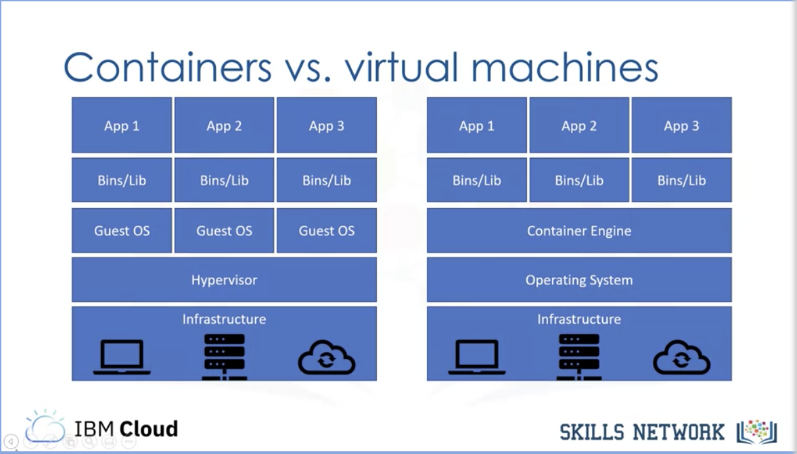

# Containers

lightweight (doesn't include guest OS)  
in linux, uses namespace and control groups to achieve virtualization  

virtual machines virtualize the hardware, allowing multiple Guest OS to run on virtualized, segregated hardware. Containers on the other hand virtualize the OS, allowing multiple apps to run on virtualized, segregated OS.



## use cases
- goes well with microservices: loosely couples and independently deployable services
- Devops: build, ship and run software
- hybrid, multi-cloud: run it consistently anywhere
- containerize your application: to migrate it to the cloud.

## Docker
- software platform for building and running containers
- containerization existed before Docker
- provided a straightforward way to build and run containers.
- "image" and "container"
- commands:  
  - build: creates container images; required a Dockerfile; tag/name the images
  - tag: names images
  - images: lists all images, their repositories and tags
  - run: runs a container
  - push/pull: storing/retrieving images from a remote location
  
- container runtime  
layer which runs the container. Docker is also considered as a container runtime.


### building container images
Dockerfile : blueprint for an image; used to build an image  
Image : immutable, read-only file containing everything needed to run an application  
Container : A running image  

Image layers: each docker instruction creates a new read-only layer.  
Iterative Image Build
When the image layer is then run, a container layer is added, which is mutable.  

layers can be shared between images, which saves disk space and network bandwidth  


#### Dockerfile instructions
- FROM
  - define base image
- RUN
  - execute arbitrary commands
- ENV
  - set environment variables
- ADD (from remote url) and COPY (only local files)
  - copy files and directories
- CMD
  - default command for container execution (last CMD is run in case several are present)


## Docker commands
```bash
## list images
docker image ls

## list dangling images
docker images -f dangling=true

## remove a docker images
docker rmi <image_id> 
## or
docker image prune


## get storage location
docker image inspect <image_id>

## view layers
docker history <image_id>

```

---
#### resources
- [Dive: Explore Docker Image Layers](https://www.youtube.com/watch?v=uBd7QPvhLMU), [docker layers explained](https://dzone.com/articles/docker-layers-explained)
