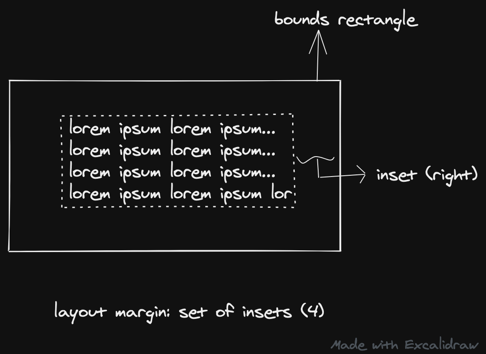

# Apple UI Layouts

- layout is about finding the positions where the UI elements will fit on the screen.
- One way to do is to explicitly specify the frame size and positions for each of the elements.  
This is obviously cumbersome given that there are various external changes (device screen sizes, screen rotation, split views on iPad, user resize) and internal changes (dynamic content, internationalization, font increase).
- Apple's earlier solution (??) was to use **autoresizing**. In this the view could be configured such that its superview could modify left/right margins and height/width.
- The modern solution is to use **autolayout**. Autoresizing is an incomplete solution as it supports only a small subset of possible layouts. Additionally it doesn't support internal changes. In autolayout, you think about the relationships between UI elements rather than their exact positions.

## Autolayout
You describe a set of equations which lead to an unambiguous solution (vs nonambiguous or unsatisfiable constraints). The autolayout engine solves this equation and calls `layoutSubviews`.  
How is screen rotation or internal change handled? What's the flow (??)


## Autolayout without constraints
- In this, we use container views like stack view. There are 4 parameters that influence the positioning of elements inside stack view:
  - axis/orientation: vertical/horizontal
  - distribution:
  - alignment:
  - spacing: 

Additionally, stack view also uses view's content-hugging and compression-resistance properties (??).
- It is recommended to use stack view for arranging stuff. However, avoiding constraints might always not be possible


## NSLayoutConstraints

```swift
item1.attribute1 = multiplier * item2.attribute2 + constant
```


- enable "Constraint to margins" to respect layout margins. It can then be set from size inspector.
- CenterX, CenterY attributes can come from either the bounds margin or layout margin.
- left vs leading layout margin: The difference is that leading layout margin takes into account the language direction (Arabic for example is right to left).

- **Anchor style** is not preferred over NSLayoutConstraint style (from iOS 9)

### constraint priorities
- unsatisfiable constraints are printed out to console.
- constraint priorities is a way to create optional constraint. Constraints with a 1000 priority is required; all others are optional. 
- auto layout attempts to satisfy all constraints from 1000 down to 1. If it cannot satisfy an optional constrain, it is skipped and next constraint is tested.
- NOTE: even if an optional constraint cannot be satisfied, it can still influence the layout - if there's any ambiguity  in the layout after skipping the constraint, the system selects the solution that comes closest to the constraint. It's like a force pulling views towards them.

---
### resources

### explore further
- autoResizingMaskIntoConstraints
- WWDC videos on auto layout
- what according to you is the ideal way to layout apps (a layout styleguide of sorts)? how is copilot or wla layout-ed?
- layout anchors ([stackoverflow](https://stackoverflow.com/questions/37796884/on-ios-what-are-the-differences-between-margins-edge-insets-content-insets-a)) and UILayoutGuide
- what are the usecase for listening layout margins changes? `layoutMarginsDidChange()`

