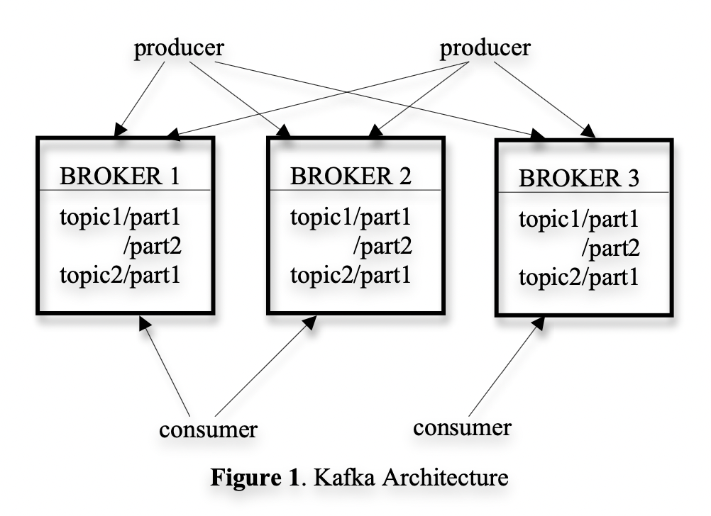

# Kafka

topic - stream of messages of a particular type. 
A producer can publish messages to a topic. These messages are then stored on a set of servers called brokers. A consumer can subscribe to one or more topics from the brokers, and consume the messages by pulling it from the brokers.

## subscriber
- subscriber - a consumer can create multiple streams for the topic. The messages published to that topic will be evenly distributed into these sub-streams. 
- each message stream is an iterator which blocks if no message is available
- Kafka supports both point-to-point delivery model (multiple consumers jointly consume a single copy of all messages in the topic) as well as publish/subscribe model (multiple consumers each retrieve their own copy of a topic)
- what's the point of substreams - to distribute load (of a topic) among multiple brokers.

### efficiency on a single partition
- logical log ~ physically implemented as a set of segment files of approximately same size (e.g. 1GB)
- messages are buffered to a configurable number and then flushed to the disk. Messages are exposed to consumers only after the flush.
- logical offsets in log are messages ids. Offsets are increasing but not necessarily consecutive (next offset is obtained by adding #bytes of the current message to the current offset). This avoids the overhead of maintaining seek-intensive random-access index structures.
- consumer issues asynchronous pull requests (starting offset + acceptable number of bytes) to indicate to the producer to get ready to send the data. The broker keeps in memory a sorted list of offsets, including the offset of the first message in every segment file. The broker can then search for the segment files where the requested offset resides, and sends the data back to the consumer.

### efficient transfer
- no kafka application level cache: Rely on OS page cache for caching and not on the application level cache. This offers advantages like low GC times on VM-based languages or availability of a warm cache on application restart. In practice, producing and consuming throughput has proved to be linear with the size of data.
- iterator patter under the hood: even though the stream iterator at consumer spits out one message at a time, under the hood, consumer receives a lot more data (100s of kilobytes).
- sendfile API: A typical approach to sending file over the network is: 1) read data from storage media to page cache, 2) page cache to application buffer, 3) application buffer to kernel buffer, 4) kernel buffer to the socket.  
In kafka, the `sendfile` api is used to eliminate steps 2 and 3.

### stateless broker
- consumer maintains how far he has consumed the messages. 
- drawback: broker doesn't know when to delete the message => have the message for a configurable retention period (typically 7 days)
- In fact, having such a long retention enables consumers to replay the messages from an earlier offet (in case the consumer crashes or other mishaps)
- even after a message is consumed, the consumer might want to replay it. For example, the consumer might be persisting the logs, and the system crashes. On recovering, it might want to replay from the last flushed message offset.

### distributed coordination
- Each producer publishes a message to either a randomly selected partition or semantically selected partition (using partitioning key and function).
- consumer groups: a Kafka concept. Each consumer group consists of one or more consumers that jointly consume a set of subscribed topics i.e. each message is delivered to only one of the consumers within the group.
- smallest unit of parallelism is the partition: which means that all messages within a partition is consumed by a single consumer (which "owns" the partition at that time). This simplifies (eliminates) the need for coordination of offsets between consumers if multiple consumers were consuming the partition.
- zookeper: A highly available consensus service, wherein you can CRUD on paths and assign value to them. The changes on these paths can be subscribed to.
  - broker registry: host + port + topics + partitions
  - consumer registry: consumer group (Set of consumers subscribing to a topic) + topics
  - consumer group registry: ownership reg.: which consumer owns a partition ; offset reg.: the offset consumed by each partition
  
- nature of the registries: apart from offset registry (which is persistent), all other registries are ephemeral.
- Each consumer registers a Zookeeper watcher on both the broker and consumer resgistry, and will be notified when a change in broker set or consumer group occurs.
- when a new consumer is added or broker/consumer change is notified via the watcher, a range based repartioning takes place. This is a rare process.
- what happenes when the notification is reached late - multiple owners come for the same partition. In this case, the first owner simply lets go of all the partition it owns, waits a bit and retries the rebalance process. In practice, the rebalance process stabilizes after a few retries.

### Delivery guarantees
- at most once; might delivery multiple times, for example when the consumer crashes and recovers.
- add your own de-duplication logic if needed:
- within the same partition, the message seem to go in order (as a single consumer owns that partition at any time); but across the partitions there's no such guarantee.
- Cyclic Redundancy Check (CRD) is added to each message in the log and can be used to verify the integrity of it.
- if the broker node goes down, the data held in that broker is unavailable and if it goes corrupt, the data is lost as well. 
- future plans to add some replication in Kafka.

### others
- Linkedin uses an auditing system to verify that no data loss has occured on the whole pipeline.
- Each message stores timestamp and server name when they are generated. The producer periodically generates a monitoring event recording the number of messages published by that producer for each topic in a given time window. The producer publishes this event to Kafka in a separate topic. The consumers can then count the number of messages they've received from a particular topic and validate those counts.

---
#### resources
- [Kafka: a distributed messaging sysyem for log processing](https://notes.stephenholiday.com/Kafka.pdf)

#### further
Avro: the serialization protocol  
Zookerper: highly reliable cluster for distributed consensus
