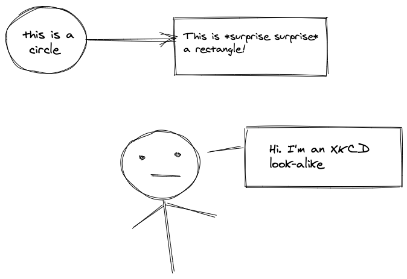

# Cool Tools

1. **[Observable HQ](https://observablehq.com/)**  
A social media for visualized data.  
e.g.: [d3 magic](https://observablehq.com/@d3) and [random tree](https://observablehq.com/@d3/random-tree?collection=@d3/d3-hierarchy)

2. **[Pandadoc filter](https://github.com/hertogp/imagine)**  
To process markdown codeblocks into images or ascii art  
Neuron needs to support this in its site generation. See [github issue](https://github.com/srid/neuron/issues/363) 

3. **[Excalidraw](https://excalidraw.com/)**  
Hand drawn images (almost xkcd like), with a cool option to "copy to clipboard as png/svg"; dark mode

4. **[DiffChecker](https://www.diffchecker.com/)** \
Check diffs between texts/images/pdfs/excel/folders. \
Also has a CLI version.

5. **[Asciinema](https://asciinema.org/)** \
Record and share your terminal sessions (the right way). Forget screen recording apps and  blurry video. \
Allows the viewer to copy paste the command as well (it's all text) \
Allows easy embedding in your blog post. \
Use `asciinema rec` to start recording

6. **[LICECap](https://www.cockos.com/licecap/)**
desktop app to screen capture in gif form on mac

7. **[Emacs: Undo History](https://elpa.gnu.org/packages/undo-tree.html)**
Treat undo history as a tree

8. **[Gps point plotter](https://gpspointplotter.com/)**
Given a bunch of gps points (lat, long), plot the route on a map view.

9. **[Color explorer](https://www.color-hex.com/)**
Color explorer using hex/rgb etc. Generates css and html code.

10. **[SIP calculator](https://sipcalculator.in/result)**

11. **[auto layout errors in iOS](https://www.wtfautolayout.com/)**

12. [[[ff0a4d8a]]]

13. [Kotlin playground](https://play.kotlinlang.org/)

14. [Dive: Explore Docker Image Layers](https://www.youtube.com/watch?v=uBd7QPvhLMU)

15. [open source ERP for everyone](https://erpnext.org/)

16. [draw UML diagrams](
https://staruml.io/)

17. [draw UML diagrams, wireframes, flowcharts etc.](https://app.diagrams.net/)

18. [[[0f064f68]]]

19. [[[38f0b39e]]]

20. [[[270f1d60]]]
