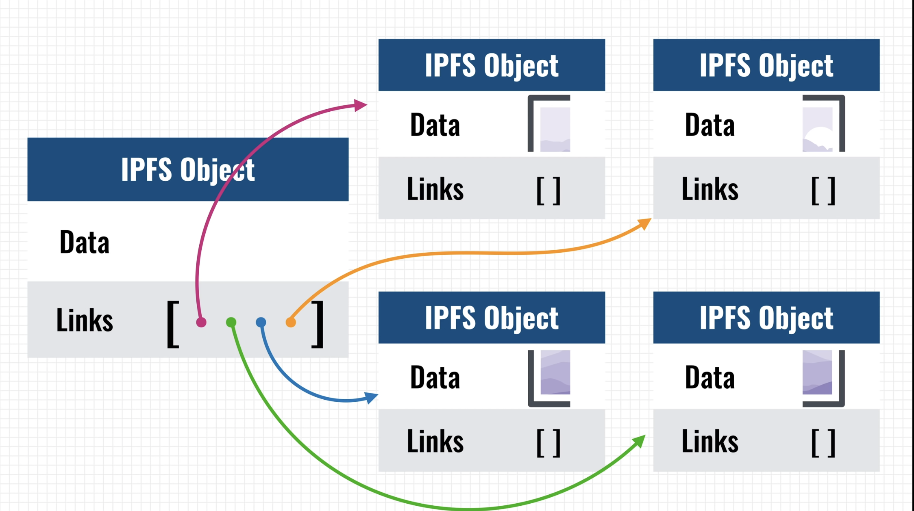

# Cryptocurrency

## Skeleton

The what?
- key features and how they're achieved. [[[0376df38]]]
- blockchain as fundamental data structure - how does it work and how does it lend the required properties to bitcoin.
  - different kinds of blockchain? what are the pros and cons of each?
  - blockchain vulnerabilities and [concerns](https://ethereum.org/en/whitepaper/#miscellanea-and-concerns)

Devil's advocate and reality check
- why would cryptocurrencies work (or not)? - from an economic perspective
- what's the current adoption of bitcoin (not as an investment, but as a currency with which one does daily transactions).
- can bitcoin and altcoins co-exist in the future? How many altcoins can exist?
- what issues have the bitcoin community faced so far? (forks etc.)
- is there a strong alternative to bitcoin that can replace it in future?
- what are the vulnerabilities of blockchain/bitcoin? (the resource should be someone invested in hacking blockchain and not bitcoin.org)
- policy ([this](https://www.youtube.com/watch?v=sMnBl0g3Ev4&list=PLUl4u3cNGP63UUkfL0onkxF6MYgVa04Fn&index=8)) and financial systems ([this](https://www.youtube.com/watch?v=l0vD_FBWk0g&list=PLUl4u3cNGP63UUkfL0onkxF6MYgVa04Fn&index=10)) role around bitcoins/blockchain 
- can bitcoin be blocked by government?
- social implications of bitcoin


Possibilities
- what other applications are possible on blockchain?
  - what markets are coming up right now.
  - what markets can blockchain possibly disrupt?
- what are the avenues via which I can profit off blockchain?
  - any upcoming industry i can foray into?


- [Intrinsic value of bitcoin](https://bitcoinmagazine.com/business/op-ed-debunking-bitcoin-myths-the-intrinsic-value-fallacy)

## [Bitcoin as a state transition system](https://ethereum.org/en/whitepaper/#bitcoin-as-a-state-transition-system)

```python
Apply(S, TX) -> S'
```   
Here `S` contains all Unspent transaction outputs (UTXOs). Each of these UTXO having a denomination and an owner (essentially a cryptographic public key).  
`TX` can contain multiple transations, with each transation having multiple inputs, each containing a reference to an existing UTXO and a cryptographic signature produced by the private key of the owner (thereby establishing ownership of the input UTXO). The transaction can have multiple outputs, which produce multiple UTXO (which is added to the new state).  

The state transition function `APPLY(S,TX) -> S'` can be defined roughly as follows:

1. For each input in TX:
   - If the referenced UTXO is not in S, return an error.
   - If the provided signature does not match the owner of the UTXO, return an error.
2. If the sum of the denominations of all input UTXO is less than the sum of the denominations of all output UTXO, return an error.
3. Return S' with all input UTXO removed and all output UTXO added.


## Digital Assets
- Colored coins: by carefully tracking the origin of bitcoins, it's possible to "color" it so as to distinguish it from the rest. These colored bitcoins can then represent stocks/bonds, alternate currencies, smart contracts.
- the question colored coins asked was: is it possible to use bitcoin technology for other applications as well? - "provably fair gambling systems" like SatoshiDice, transperancy in business and NGOs etc.
  - A local community might wish to create a community currency, using the Bitcoin infrastructure to securely store funds.
  - A company may wish to create a corporate currency, such as Air Miles rewards points, or even plain coupons.
  - An issuer might wish to release a coin to represent deposits, allowing people to trade, for example, "Bitstamp-USD coins" or some gold storage company's "gold coins".
  
- **ERC-721** is the first standard to create NFTs on ethereum blockchain. **ERC-1155** is the standard to create semi-fungible assets using which one can create a commodity class - there can be x number of particular digital commodity, each fungible among themselves.


## Non-fungible Tokens
- It's a digital certificate of ownership and authenticity that says you are the owner of a unique piece of digital asset like GIF or digital art.
- It very much maps to collectibles in real life. [Open Sea](https://opensea.io) is an NFT marketplace. So is [Rarible](https://rarible.com) which allows one to convert their digital art to NFTs.


---
## Ethereum

### Accounts
- in ehtereum, the state is made of objects called "accounts'. State transitions are direct transfer of value and information between accounts. It has 4 fields:
  - nonce (what's the use of nonce??): integer that is incremented everytime the contract is executed. what happens for EOA(??)
  - ether balance
  - contract code, if present
  - account's storage, if present

- **Externally owned accounts** (controlled by private keys) and **contract accounts** (controlled by contract code)
- smart contract addressed identify a smart contract on the blockchain
- EOA is mostly controlled by humans, but you might give the private key to a program off blockchain, and so the EOA is now owned by that program.

### Transactions

1. a transaction is used to in ethereum is a signed data packaged that stores a message to be sent from an external owned account. It contains:
- receipient of the message
- signature identifying the sender (using private key of sender)
- amount of ether to be transferred (expressed in wei, where 1 ether = 10^18 wei)
- optional data field (what's the use??)
- STARTGAS - maximum number of computation steps the transaction execution is allowed to take
- GASPRICE - fee (ether, actually expressed as gwei, where 1 ether = 10^9 gwei) the sender pays per computational step (1 gas).  


2. STARTGAS and GASPRICE are crucial for enthereum's anti-denial of service model (to prevent malicious infinite loops or computational wastage). The fundamental unit of computations is **gas**. Usually each computational step costs 1 gas, but some steps might cost more because they are more expensive to perform or result in storage increase. Also, for each byte in transaction data, there is a fees of 5 gas.
3. The idea is to require an attacker to pay proportionately for each kind of resource they use - computations, bandwidth or storage.

### Messages
1. contracts have the ability to send "messages" to other contracts. These are virtual objects that're never serialized and exist only in the ethereum execution environment. It contains:
- sender of the message
- recipient 
- amount of ether to transfer
- optional data field
- STARTGAS value

2. message is like a transaction, except that it's produced by a contract and not an external actor. It allows contracts to have relationships with other contracts, in the same way external accounts can.
3. Gas allowances assigned transaction or contract applies to the total gas consumed by that transaction and all sub-executions.
4. Why does messages have to GASPRICE (??) - perhaps because GASPRICE is "inherited" from the initial transaction package.

### Code execution 
- written in EVM code. In general the code execution is an infinite loop, which consists of repeatedly executing the operation at the current program counter. This is done until end of code is reached or error or STOP or RETURN instruction is found.
- the code can store data in following space: The **stack**, **memory** (infititely expandable), contract's **long term key-value store** (unlike stack and memory which is reset after contract's execution complete, this can persist for long term)
- it can access value, sender, data of the incoming message.

### ethereum blockchain and mining
- ethereum blockchain additionally stores the recent state (apart from the transaction list like in bitcoin), the difficult and block number.
- [patricia trie](https://www.youtube.com/watch?v=dbTVU8jR0Vs): trie -> compact trie -> patricia trie (most compact trie)
- because state information is available for the previous block, there's no need to store the entire blockhain history.

---
## more concepts
### decentralized storage
- think of it as a p2p network where members pool together their disk space to create a global shared memory. A deccentralized dropbox of sorts.
- **IPFS** (InterPlanetary file System) and **swarm** are examples
- Swarm is part of ethereum stack. It provides the storage layer for ethereum (it's part of **geth**)

- IPFS uses content based addressing (where you query for a file based on its hash) rather than location based addressing (used by traditional web, https://www.example.com/cat.jpg etc.).  
IPFS can download the content (identified by hash) from any peer. The content can be checked to see if the hash matched (hence security).
- Content is created only once => very efficient
- immutable. Data modification happens based on versioning
- problems: availability (same as bittorrent without users) - the solution is to either incentivize the nodes or proactively distribute files. This is what **Filecoin** intends to do. It's build on top of IPFS.
- applications? see [IPFS getting around wikipedia censorship by Turkey](https://blog.ipfs.io/24-uncensorable-wikipedia/), and [dtube](https://d.tube/) - decentralised youtube

- links: [decentralized storage explained](https://www.youtube.com/watch?v=5Vu_jwPjvww)



### Ethereum holy trinity: Swarm, Ethereum and Whisper
- Swarm provides the storage layer, ethereum provides the computation power and whisper provides the messaging layer.
- decentralized internet

---
### questions
- what really is the energy consumption of bitcoin (or in general, blockchain) network?
  - does mining vs validation have different energy requirements? [start [here](https://www.mangoresearch.co/blockchain-consensus-vs-validation/)]
- what happens when a bitcoin wallet is lost? Can someone lose a lot of bitcoins and those would be out of circulation forever? What does this always decreasing property of bitcoin means for its stability?
- how much time does it take for a transaction to be verified? How far into the future can it be refuted?
- how merkel trees are used in bitcoins?
- devil's advocate:
  - what are the arguments for bitcoin failing
  - will bitcoing economy ever emerge? What will happen if it doesn't?
  - how exactly is bitcoin not prone to inflation?
- some research around the genuine uses of blockchain vs the hype.
- are there less energy intensive ways of achieving decentralised consensus?

- volatility in price: the idea to control volatility is to adjust the supply when the demand goes up or down. In bitcoin, when people are hoarding it up, its value is solely expressed as a function of demand. Ether is a bit more flexible. Stablecoins like Dai have solved this problem.

for trading; https://www.binance.com/  
crypto20 - an index fund for top 20 best performing cryptocurrencies
fucking invest in ether! It's going to be big
which meetup or conferences covers new tech? (to follow)
what are the advantages or disadvantages of building NFT on ethereum vs polkadot etc.
sell some of your photographs as NFTs - https://academy.binance.com/en/articles/how-to-make-your-own-nfts
dogecoin
see if you can profit from Filecoin
[ethereum book - Mastering ethereum](https://github.com/ethereumbook/ethereumbook/blob/develop/book.asciidoc)
next job in blockchain domain (+ rust)??
blockchain development courses and OSS
host blog on IPFS
will i lose money due to rounding off in wazir?
Ethereum 2 - how does ETH translate to this? Is there a chance of hard fork here?
bunch of resources for crypto - https://drive.google.com/folderview?id=1v5cq2OmAOZ5RWv1YU3PyxPAvXiWewFkB

proof of work vs proof of stake
uniswap


ideas:
- converting ebooks into a mobi - these can then be sold like physical ebooks...only the owners can unlock.


blockchain development
[by microsoft](https://docs.microsoft.com/en-us/learn/paths/ethereum-blockchain-development/)
[edureka](https://www.edureka.co/career-guide/blockchain-developer)
[learn solidity using space doggos](https://www.bitdegree.org/course/learn-solidity-space-doggos)
[how to become a blockchain developer](https://ledumjg.medium.com/how-to-become-a-blockchain-developer-dd0d4b83cc37
)
[building an NFT](https://www.education-ecosystem.com/rohit99/RaWxv-how-to-create-non-fungible-erc721-ethereum-token/MzMkN-intro-how-to-create-non-fungible-erc721-ethereum-t/)
[path to become a blockchain developer](https://www.reddit.com/r/CryptoCurrency/comments/7zlvge/the_path_to_become_a_blockchain_developer/)
[BAT](https://basicattentiontoken.org/wp-content/uploads/2017/05/BasicAttentionTokenWhitePaper-4.pdf)
[polkadot wiki](https://wiki.polkadot.network/)
[parity tech jobs](https://www.parity.io/jobs/)
